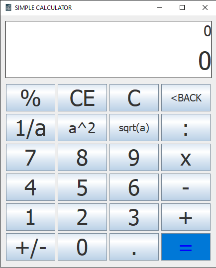

# The Hi-School App🚀

 

## ⭐ Introduction
Welcome to our simple calculator application developed using the Java programming language. This calculator is designed to perform basic arithmetic operations such as addition, subtraction, multiplication, and division. With a user-friendly interface and intuitive functionality, our calculator aims to provide a convenient solution for performing calculations quickly and efficiently. Whether you're a student, professional, or anyone in need of a handy tool for everyday calculations, our Java-based calculator is here to meet your needs. Let's dive in and explore the simplicity and versatility of our calculator application.
    
## 🐦 Follow Me:

> [LinkedIn](https://www.linkedin.com/in/vankieuit/)

I hope you like the project. Thanks for reading :)
